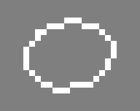
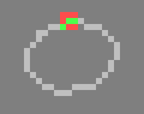
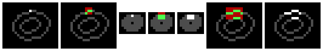

# Submanifold Sparse Convolutional Networks

This is the PyTorch library for training Submanifold Sparse Convolutional Networks.

## Spatial sparsity

This library brings [Spatially-sparse convolutional networks](https://github.com/btgraham/SparseConvNet) to PyTorch. Moreover, it introduces **Submanifold Sparse Convolutions**, that can be used to build computationally efficient sparse VGG/ResNet/DenseNet-style networks.

With regular 3x3 convolutions, the set of active (non-zero) sites grows rapidly:<br />
 <br />
With **Submanifold Sparse Convolutions**, the set of active sites is unchanged. Active sites look at their active neighbors (green); non-active sites (red) have no computational overhead: <br />
 <br />
Stacking Submanifold Sparse Convolutions to build VGG and ResNet type ConvNets, information can flow along lines or surfaces of active points.<br />

Disconnected components don't communicate at first, although they will merge due to the effect of strided operations, either pooling or convolutions. Additionally, adding ConvolutionWithStride2-SubmanifoldConvolution-DeconvolutionWithStride2 paths to the network allows disjoint active sites to communicate; see the 'VGG+' networks in the paper.<br />
 <br />
 <br />
From left: **(i)** an active point is highlighted; a convolution with stride 2 sees the green active sites **(ii)** and produces output **(iii)**, 'children' of hightlighted active point from (i) are highlighted; a submanifold sparse convolution sees the green active sites **(iv)** and produces output **(v)**; a deconvolution operation sees the green active sites **(vi)**  and produces output **(vii)**.

## Dimensionality and 'submanifolds'

SparseConvNet supports input with different numbers of spatial/temporal dimensions.
Higher dimensional input is more likely to be sparse because of the 'curse of dimensionality'. <br />

  Dimension|Name in 'torch.nn'|Use cases
  :--:|:--:|:--:
  1|TemporalConvolution| Text, audio
  2|SpatialConvolution|Lines in 2D space, e.g. handwriting
  3|VolumetricConvolution|Lines and surfaces in 3D space or (2+1)D space-time
  4| - |Lines, etc,  in (3+1)D space-time

We use the term 'submanifold' to refer to input data that is sparse because it has a lower effective dimension than the space in which it lives, for example a one-dimensional curve in 2+ dimensional space, or a two-dimensional surface in 3+ dimensional space.

In theory, the library supports up to 10 dimensions. In practice, ConvNets with size-3 SVC convolutions in dimension 5+ may be impractical as the number of parameters per convolution is growing exponentially. Possible solutions include factorizing the convolutions (e.g. 3x1x1x..., 1x3x1x..., etc), or switching to a hyper-tetrahedral lattice (see [Sparse 3D convolutional neural networks](http://arxiv.org/abs/1505.02890)).


## Hello World
SparseConvNets can be built either by [defining a function that inherits from torch.nn.Module](examples/Assamese_handwriting/VGGplus.py) or by stacking modules in a [sparseconvnet.Sequential](PyTorch/sparseconvnet/sequential.py):
```
import torch
import sparseconvnet as scn

# Use the GPU if there is one, otherwise CPU
use_gpu = torch.cuda.is_available()

model = scn.Sequential().add(
    scn.SparseVggNet(2, 1,
		     [['C',  8], ['C',  8], ['MP', 3, 2],
		      ['C', 16], ['C', 16], ['MP', 3, 2],
		      ['C', 24], ['C', 24], ['MP', 3, 2]])
).add(
    scn.SubmanifoldConvolution(2, 24, 32, 3, False)
).add(
    scn.BatchNormReLU(32)
).add(
    scn.SparseToDense(2,32)
)
if use_gpu:
    model.cuda()

# output will be 10x10
inputSpatialSize = model.input_spatial_size(torch.LongTensor([10, 10]))
input = scn.InputBatch(2, inputSpatialSize)

msg = [
    " X   X  XXX  X    X    XX     X       X   XX   XXX   X    XXX   ",
    " X   X  X    X    X   X  X    X       X  X  X  X  X  X    X  X  ",
    " XXXXX  XX   X    X   X  X    X   X   X  X  X  XXX   X    X   X ",
    " X   X  X    X    X   X  X     X X X X   X  X  X  X  X    X  X  ",
    " X   X  XXX  XXX  XXX  XX       X   X     XX   X  X  XXX  XXX   "]

#Add a sample using set_location
input.add_sample()
for y, line in enumerate(msg):
    for x, c in enumerate(line):
	if c == 'X':
	    location = torch.LongTensor([x, y])
	    featureVector = torch.FloatTensor([1])
	    input.set_location(location, featureVector, 0)

#Add a sample using set_locations
input.add_sample()
locations = []
features = []
for y, line in enumerate(msg):
    for x, c in enumerate(line):
	if c == 'X':
	    locations.append([x,y])
	    features.append([1])
locations = torch.LongTensor(locations)
features = torch.FloatTensor(features)
input.set_locations(locations, features, 0)

# Optional: allow metadata preprocessing to be done in batch preparation threads
# to improve GPU utilization.
#
# Parameter:
#    3 if using MP3/2 pooling or C3/2 convolutions for downsizing,
#    2 if using MP2 pooling for downsizing.
input.precomputeMetadata(3)

model.train()
if use_gpu:
    input.cuda()
output = model.forward(input)

# Output is 2x32x10x10: our minibatch has 2 samples, the network has 32 output
# feature planes, and 10x10 is the spatial size of the output.
print(output.size(), output.type())
```


## Examples

Examples in the examples folder include
* [Assamese handwriting recognition](https://archive.ics.uci.edu/ml/datasets/Online+Handwritten+Assamese+Characters+Dataset#)
* [Chinese handwriting for recognition](http://www.nlpr.ia.ac.cn/databases/handwriting/Online_database.html)
* [3D Segmentation](https://shapenet.cs.stanford.edu/iccv17/) using ShapeNet Core-55

Data will be downloaded/preprocessed on the first run, i.e.
```
cd examples/Assamese_handwriting
python VGGplus.py
```

## Setup

Tested with Ubuntu 16.04, Python 3.6 in [Miniconda](https://conda.io/miniconda.html) and PyTorch v0.4 (with merged Tensors/Variables).

```
conda install pytorch -c pytorch
conda install google-sparsehash -c bioconda   # OR apt-get install libsparsehash-dev
conda install -c anaconda pillow
git clone git@github.com:facebookresearch/SparseConvNet.git
cd SparseConvNet/
bash build.sh
```
To run the examples you may also need to install unrar:
```
apt-get install unrar
```


### Links
1. [ICDAR 2013 Chinese Handwriting Recognition Competition 2013](http://www.nlpr.ia.ac.cn/events/CHRcompetition2013/competition/Home.html) First place in task 3, with test error of 2.61%. Human performance on the test set was 4.81%. [Report](http://www.nlpr.ia.ac.cn/events/CHRcompetition2013/competition/ICDAR%202013%20CHR%20competition.pdf)
2. [Spatially-sparse convolutional neural networks, 2014](http://arxiv.org/abs/1409.6070) SparseConvNets for Chinese handwriting recognition
3. [Fractional max-pooling, 2014](http://arxiv.org/abs/1412.6071) A SparseConvNet with fractional max-pooling achieves an error rate of 3.47% for CIFAR-10.
4. [Sparse 3D convolutional neural networks, BMVC 2015](http://arxiv.org/abs/1505.02890) SparseConvNets for 3D object recognition and (2+1)D video action recognition.
5. [Kaggle plankton recognition competition, 2015](https://www.kaggle.com/c/datasciencebowl) Third place. The competition solution is being adapted for research purposes in [EcoTaxa](http://ecotaxa.obs-vlfr.fr/).
6. [Kaggle Diabetic Retinopathy Detection, 2015](https://www.kaggle.com/c/diabetic-retinopathy-detection/) First place in the Kaggle Diabetic Retinopathy Detection competition.
7. [Submanifold Sparse Convolutional Networks, 2017](https://arxiv.org/abs/1706.01307) Introduces deep 'submanifold' SparseConvNets.
8. [Workshop on Learning to See from 3D Data, 2017](https://shapenet.cs.stanford.edu/iccv17workshop/) First place in the [semantic segmentation](https://shapenet.cs.stanford.edu/iccv17/) competition. [Report](https://arxiv.org/pdf/1710.06104)
9. [3D Semantic Segmentation with Submanifold Sparse Convolutional Networks, 2017](https://arxiv.org/abs/1711.10275) Semantic segmentation for the ShapeNet Core55 and NYU-DepthV2 datasets, CVPR 2018

### Citations

If you find this code useful in your research then please cite:

**[Submanifold Sparse Convolutional Networks, https://arxiv.org/abs/1706.01307](https://arxiv.org/abs/1706.01307)** <br />
[Benjamin Graham](https://research.fb.com/people/graham-benjamin/), <br />
[Laurens van der Maaten](https://lvdmaaten.github.io/), <br />

```
@article{SubmanifoldSparseConvNet,
  title={Submanifold Sparse Convolutional Networks},
  author={Graham, Benjamin and van der Maaten, Laurens},
  journal={arXiv preprint arXiv:1706.01307},
  year={2017}
}
```

and/or

**[3D Semantic Segmentation with Submanifold Sparse Convolutional Networks, CVPR 2018](https://arxiv.org/abs/1711.10275)** <br />
[Benjamin Graham](https://research.fb.com/people/graham-benjamin/), <br />
[Martin Engelcke](http://ori.ox.ac.uk/mrg_people/martin-engelcke/), <br />
[Laurens van der Maaten](https://lvdmaaten.github.io/), <br />

```
@article{3DSemanticSegmentationWithSubmanifoldSparseConvNet,
  title={3D Semantic Segmentation with Submanifold Sparse Convolutional Networks},
  author={Graham, Benjamin and Engelcke, Martin and van der Maaten, Laurens},
  journal={CVPR},
  year={2018}
}
```
