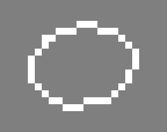
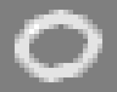
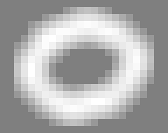

# Submanifold Sparse Convolutional Networks

This is the Torch/PyTorch library for training Submanifold Sparse Convolutional Networks; see the paper

**[Submanifold Sparse Convolutional Networks, https://arxiv.org/abs/1706.01307](https://arxiv.org/abs/1706.01307)** <br />
[Benjamin Graham](https://research.fb.com/people/graham-benjamin/), <br />
[Laurens van der Maaten](https://lvdmaaten.github.io/), <br />
arXiv 2017


## Spatial sparsity

This library brings [Spatially-sparse convolutional networks](https://github.com/btgraham/SparseConvNet) to Torch/PyTorch. Moreover, it introduces **Valid Sparse Convolutions**, that can be used to build computationally efficient sparse VGG/ResNet/DenseNet-style networks.

With regular 3x3 convolutions, the set of active (non-zero) sites grows rapidly:<br />
     <br />
With **Valid Sparse Convolutions**, the set of active sites is unchanged. Active sites look at their active neighbors (green); non-active sites (red) have no computational overhead: <br />
 <br />
Stacking Sparse Valid Convolutions to build VGG and ResNet type ConvNets, information can flow along lines or surfaces of active points.<br />

Disconnected components don't communicate at first, although they will merge due to the effect of strided operations, either pooling or convolutions. Additionally, adding ConvolutionWithStride2-ValidConvolution-DeconvolutionWithStride2 paths to the network allows disjoint active sites to communicate; see the 'VGG+' networks in the paper.<br />
 <br />
 <br />
From left: **(i)** an active point is highlighted; a convolution with stride 2 sees the green active sites **(ii)** and produces output **(iii)**, 'children' of hightlighted active point from (i) are highlighted; a sparse valid convolution sees the green active sites **(iv)** and produces output **(v)**; a deconvolution operation sees the green active sites **(vi)**  and produces output **(vii)**.

## Dimensionality and 'submanifolds'

SparseConvNet supports input with different numbers of spatial/temporal dimensions.
Higher dimensional input is more likely to be sparse because of the 'curse of dimensionality'. <br />

  Dimension|Name in 'torch.nn'|Use cases
  :--:|:--:|:--:
  1|TemporalConvolution| Text, audio
  2|SpatialConvolution|Lines in 2D space, e.g. handwriting
  3|VolumetricConvolution|Lines and surfaces in 3D space or (2+1)D space-time
  4| - |Lines, etc,  in (3+1)D space-time

We use the term 'submanifold' to refer to input data that is sparse because it has a lower effective dimension than the space in which it lives, for example a one-dimensional curve in 2+ dimensional space, or a two-dimensional surface in 3+ dimensional space.

In theory, the library supports up to 10 dimensions. In practice, ConvNets with size-3 SVC convolutions in dimension 5+ may be impractical as the number of parameters per convolution is growing exponentially. Possible solutions include factorizing the convolutions (e.g. 3x1x1x..., 1x3x1x..., etc), or switching to a hyper-tetrahedral lattice (see [Sparse 3D convolutional neural networks](http://arxiv.org/abs/1505.02890)).


## Hello World - PyTorch
The PyTorch interface is similar to the PyTorch's torch.nn.legacy interface
```
import torch
import sparseconvnet.legacy as scn

# Use the GPU if there is one, otherwise CPU
tensorType = 'torch.cuda.FloatTensor' if torch.cuda.is_available() else 'torch.FloatTensor'

model = scn.Sequential().add(
    scn.SparseVggNet(2, 1,
       [['C',  8], ['C',  8], ['MP', 3, 2],
        ['C', 16], ['C', 16], ['MP', 3, 2],
        ['C', 24], ['C', 24], ['MP', 3, 2]])
).add(
    scn.ValidConvolution(2, 24, 32, 3, False)
).add(
    scn.BatchNormReLU(32)
).add(
    scn.SparseToDense(2)
).type(tensorType)

# output will be 10x10
inputSpatialSize = model.suggestInputSize(torch.LongTensor([10, 10]))
input = scn.InputBatch(2, inputSpatialSize)

msg = [
    " X   X  XXX  X    X    XX     X       X   XX   XXX   X    XXX   ",
    " X   X  X    X    X   X  X    X       X  X  X  X  X  X    X  X  ",
    " XXXXX  XX   X    X   X  X    X   X   X  X  X  XXX   X    X   X ",
    " X   X  X    X    X   X  X     X X X X   X  X  X  X  X    X  X  ",
    " X   X  XXX  XXX  XXX  XX       X   X     XX   X  X  XXX  XXX   "]
input.addSample()
for y, line in enumerate(msg):
    for x, c in enumerate(line):
        if c == 'X':
            location = torch.LongTensor([x, y])
            featureVector = torch.FloatTensor([1])
            input.setLocation(location, featureVector, 0)

# Optional: allow metadata preprocessing to be done in batch preparation threads
# to improve GPU utilization.
#
# Parameter:
#    3 if using MP3/2 pooling or C3/2 convolutions for downsizing,
#    2 if using MP2 pooling for downsizing.
input.precomputeMetadata(3)

model.evaluate()
input.type(tensorType)
output = model.forward(input)

# Output is 1x32x10x10: our minibatch has 1 sample, the network has 32 output
# feature planes, and 10x10 is the spatial size of the output.
print(output.size())
```

## Hello World - (Lua)Torch
Convolutional networks are built with SparseConvNet in the same way as with Torch's nn/cunn/cudnn packages.
```
--Train on the GPU if there is one, otherwise CPU
scn=require 'sparseconvnet'
tensorType = scn.cutorch and 'torch.CudaTensor' or 'torch.FloatTensor'


model = scn.Sequential()
:add(scn.SparseVggNet(2,1,{ --dimension 2, 1 input plane
      {'C', 8}, -- 3x3 VSC convolution, 8 output planes, batchnorm, ReLU
      {'C', 8}, -- and another
      {'MP', 3, 2}, --max pooling, size 3, stride 2
      {'C', 16}, -- etc
      {'C', 16},
      {'MP', 3, 2},
      {'C', 24},
      {'C', 24},
      {'MP', 3, 2}}))
:add(scn.Convolution(2,24,32,3,1,false)) --an SC convolution on top
:add(scn.BatchNormReLU(32))
:add(scn.SparseToDense(2))
:type(tensorType)

--[[
To use the network we must create an scn.InputBatch with right dimensionality.
If we want the output to have spatial size 10x10, we can find the appropriate
input size, give that we uses three layers of MP3/2 max-pooling, and finish
with a SC convoluton
]]

inputSpatialSize=model:suggestInputSize(torch.LongTensor{10,10}) --103x103
input=scn.InputBatch(2,inputSpatialSize)

--Now we build the input batch, sample by sample, and active site by active site.
msg={
  " O   O  OOO  O    O    OO     O       O   OO   OOO   O    OOO   ",
  " O   O  O    O    O   O  O    O       O  O  O  O  O  O    O  O  ",
  " OOOOO  OO   O    O   O  O    O   O   O  O  O  OOO   O    O   O ",
  " O   O  O    O    O   O  O     O O O O   O  O  O  O  O    O  O  ",
  " O   O  OOO  OOO  OOO  OO       O   O     OO   O  O  OOO  OOO   ",
}

input:addSample()
for y,line in ipairs(msg) do
  for x = 1,string.len(line) do
    if string.sub(line,x,x) == 'O' then
      local location = torch.LongTensor{x,y}
      local featureVector = torch.FloatTensor{1}
      input:setLocation(location,featureVector,0)
    end
  end
end

--[[
Optional: allow metadata preprocessing to be done in batch preparation threads
to improve GPU utilization.

Parameter:
3 if using MP3/2 or size-3 stride-2 convolutions for downsizeing,
2 if using MP2
]]
input:precomputeMetadata(3)

model:evaluate()
input:type(tensorType)
output = model:forward(input)

--[[
Output is 1x32x10x10: our minibatch has 1 sample, the network has 32 output
feature planes, and 10x10 is the spatial size of the output.
]]
print(output:size())
```

## Examples

Examples in the examples folder include
* [Assamese handwriting recognition](https://archive.ics.uci.edu/ml/datasets/Online+Handwritten+Assamese+Characters+Dataset#)
* [Chinese handwriting for recognition](http://www.nlpr.ia.ac.cn/databases/handwriting/Online_database.html)
* [ModelNet-40 Object recognition](http://modelnet.cs.princeton.edu/) using [3dcnn.torch preprocessed data](https://github.com/charlesq34/3dcnn.torch)

Data will be downloaded/preprocessed on the first run, i.e.
```
cd examples/Assamese_handwriting
th VGGplus.lua

or

cd examples/Assamese_handwriting
python VGGplus.py
```

## Setup

Tested with Ubuntu 16.04. Install [Torch](http://torch.ch/docs/getting-started.html) and/or [PyTorch](http://pytorch.org/) ([Miniconda](https://conda.io/miniconda.html)) then: <br />
```
apt-get install libsparsehash-dev
git clone git@github.com:facebookresearch/SparseConvNet.git

then

cd SparseConvNet/Torch/
luarocks make sparseconvnet-1.0-0.rockspec

and/or

cd SparseConvNet/PyTorch/
pip install .
```
To run the examples you may also need to install unrar and TorchNet:
```
apt-get install unrar

and

luarocks install torchnet

or

pip install git+https://github.com/pytorch/tnt.git@master
```

## Bibtex

If you find this code useful in your research then please cite:

```
@article{SubmanifoldSparseConvNet,
  title={Submanifold Sparse Convolutional Networks},
  author={Graham, Benjamin and van der Maaten, Laurens},
  journal={arXiv preprint arXiv:1706.01307},
  year={2017}
}
```
